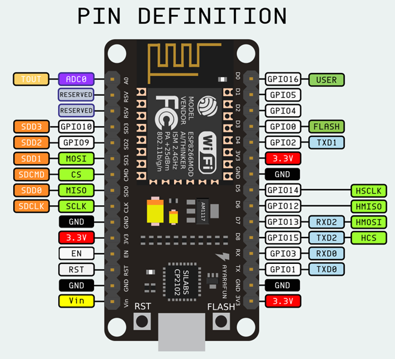
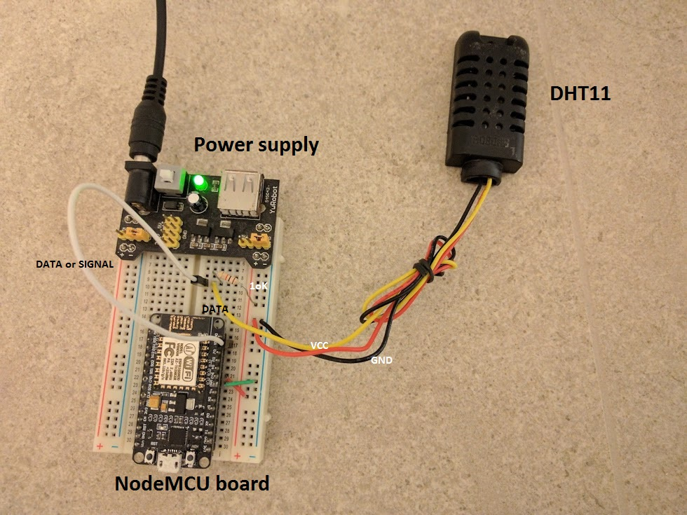
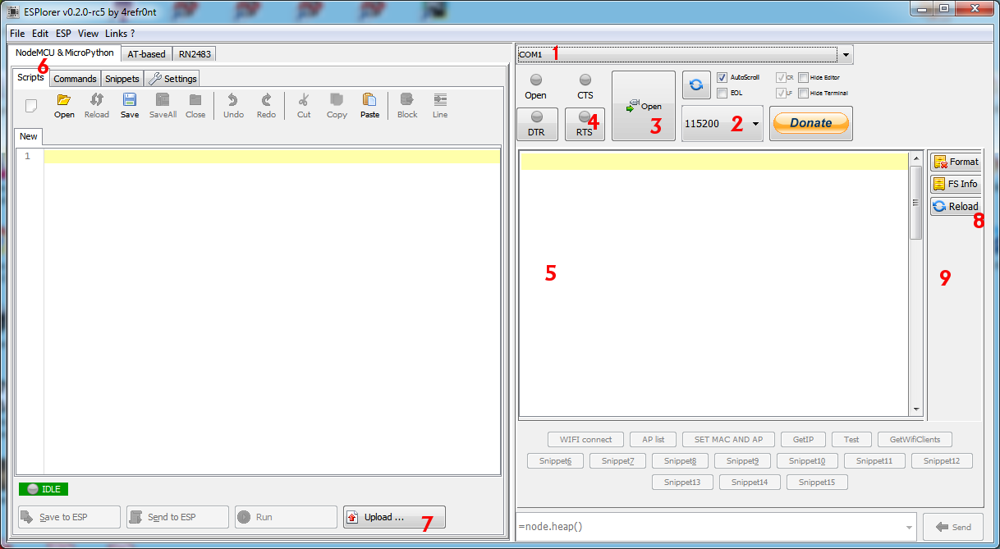

Hardware
========

Setting up the logger consists of several steps:
   1. attaching the sensor's data lines
   2. flashing the firmware
   3. configuring the lua code for site and sensor
   4. uploading configured code to the unit

NodeMCU
-------------------
NodeMCU 1.0 board pin layout:

There are several versions of the NodeMCU board in the wild:
  * V1, an official NodeMCU 0.9
  * V2, an official NodeMCU 1.0
  * V3, very similar to V2, made by LoLin

For our purposes, they are the same. V1 (0.9) has different
dimensions and does not fit to the breadboard.
LoLin has exposed some more pins, which are reserved in V2.

Note that the pin number used in software is defined by letter D
on the board. E.g.: pin 1 is D1 on board and is GPIO5.
Avoid using D0 (GPIO16), D3 (GPIO0), D4 (GPIO2) and D8 (GPIO15)
unless you know what you're doing. They are pulled up high or low
and define the board boot process.

V2 boards include ESP-12E with 32Mbits (equals 4MBytes) of flash.

Official documentation: https://nodemcu.readthedocs.io/

Connecting sensors
------------------
This is sensor-specific. Here, a simple DHT sensor was connected:

Red and black wires of the sensor are connected to +3.3V and GND, respectively. The yellow wire (data) is connected to the pin 1 (D1, GPIO5) and pulled up to +3.3V with 1k resistor.

Connecting the board to computer
--------------------------------
CH340/CH341 "USB to serial" drivers are needed.

https://github.com/nodemcu/nodemcu-devkit/tree/master/Drivers

In Windows, a succesful connect will create a new serial port, viewable in "Device manager" under "Ports (COM & LPT)"".

Flashing the firmware
---------------------
Recommended flasher on Windows: https://github.com/marcelstoer/nodemcu-pyflasher

Choose:
  * select serial port,
  * set firmware file from folder `firmware`,
  * 115200 baud rate (try with more later),
  * Dual Flash - DIO

and press flash button.

Firmware is included in the source. It was custom build on
https://nodemcu-build.com/ with selected modules:
cjson, cron, dht, file, gpio, net, node, rtctime, sntp, tmr, uart, wifi, tls.

Other flashers and more Details: https://nodemcu.readthedocs.io/en/master/en/flash/

Uploading code
--------------
Lua code from the repository must first be [configured](Configuration.md)
with local parameters (wifi, location, sensor connections, reading the
sensors) and then uploaded to the device.

For start, one can use ESPlorer at https://esp8266.ru/esplorer/.
Install, run, in the top of the right panel choose the appropriate
  1. COM port,
  2. speed 115200 and
  3. press Open the port.
  4. By switching RTS icon ON and OFF, the device resets and restarts.
  5. The Lua prompt appears. Message about missing `init.lua` is normal.
  6. In the left panel, choose tabs "NodeMCU & MicroPython", "Scripts",
  7. at the bottom right click a button "Upload", select all lua files
     and upload them at once.
  8. On the right panel, the names of uploaded files should appear
     (otherwise press Reload button).
  9. Click on `compile_all.lua` file to run it. It will compile the code to
     reduce the memory footprint.

Running the code
----------------
The code is automatically run via `init.lua`, however, there is
a 5 second delay. If there is a bootlop, one can delete `init.lua`
file during this 5 second period to avoid autorun on the next boot.

Deleting can be done in the right panel, right click on `init.lua`
and choose remove, or send command `=file.remove("init.lua")`.
Also, rename can be used `=file.rename("init.lua", "init.tmp")` and
then back.

Without autorun the code is run by running `main.lua`
(send command `=dofile(main.lua)` or click on the filename in
the right panel).
